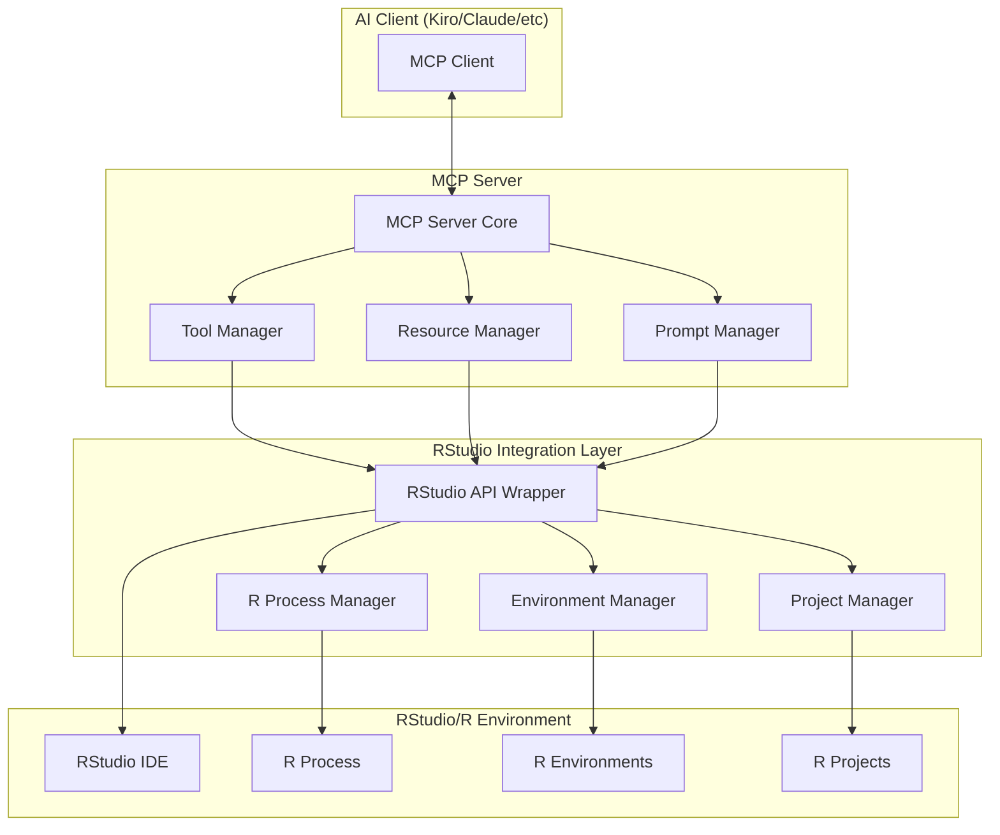

# RStudio MCP Server Design Document

## Overview

RStudio MCP Server是一个基于Model Context Protocol (MCP) 规范的服务器实现，旨在为AI助手提供与RStudio深度集成的能力。该服务器遵循MCP 2025-06-18规范，实现了完整的工具(Tools)、资源(Resources)和提示(Prompts)功能。

该设计采用模块化架构，支持STDIO和SSE传输协议，提供类型安全的JSON-RPC 2.0通信，并实现了完整的MCP生命周期管理。服务器将作为AI客户端和RStudio之间的标准化桥梁，解决现有AI编程助手在R语言环境管理方面的不足。

## Architecture

### 系统架构图



### 技术栈

- **语言**: Python 3.8+
- **MCP框架**: mcp-python SDK (遵循MCP 2025-06-18规范)
- **传输协议**: STDIO (主要) + SSE (可选)
- **通信协议**: JSON-RPC 2.0
- **RStudio集成**: rstudioapi R包 + rpy2 Python包
- **进程管理**: subprocess + asyncio
- **配置管理**: YAML/JSON配置文件
- **日志系统**: Python logging
- **测试框架**: pytest + asyncio testing

### MCP协议实现

该服务器完全遵循MCP 2025-06-18规范，实现以下核心功能：

1. **协议生命周期**: 完整的初始化、能力协商和关闭流程
2. **工具系统**: 支持工具发现、调用和结果返回
3. **资源系统**: 支持资源列表、读取和URI方案
4. **提示系统**: 支持提示模板和参数化
5. **传输层**: 支持STDIO和SSE传输
6. **错误处理**: 符合JSON-RPC 2.0错误规范

## Components and Interfaces

### 1. MCP Server Core

**职责**: 实现MCP协议的核心功能，处理客户端连接和消息路由。

```python
from mcp.server import Server
from mcp.types import (
    InitializeRequest, InitializeResult, 
    ListToolsRequest, ListToolsResult,
    CallToolRequest, CallToolResult,
    ListResourcesRequest, ListResourcesResult,
    ReadResourceRequest, ReadResourceResult,
    ListPromptsRequest, ListPromptsResult,
    GetPromptRequest, GetPromptResult,
    Implementation, ServerCapabilities
)

class RStudioMCPServer:
    def __init__(self, config: ServerConfig):
        self.config = config
        self.server = Server("rstudio-mcp")
        self.tool_manager = ToolManager()
        self.resource_manager = ResourceManager()
        self.prompt_manager = PromptManager()
        self._setup_handlers()
        
    def _setup_handlers(self):
        """设置MCP协议处理器"""
        # 初始化处理器
        @self.server.initialize()
        async def initialize() -> InitializeResult:
            return InitializeResult(
                protocolVersion="2025-06-18",
                capabilities=ServerCapabilities(
                    tools={"listChanged": True},
                    resources={"subscribe": True, "listChanged": True},
                    prompts={"listChanged": True}
                ),
                serverInfo=Implementation(
                    name="rstudio-mcp",
                    version="1.0.0"
                )
            )
        
        # 工具处理器
        @self.server.list_tools()
        async def list_tools() -> ListToolsResult:
            return await self.tool_manager.list_tools()
            
        @self.server.call_tool()
        async def call_tool(request: CallToolRequest) -> CallToolResult:
            return await self.tool_manager.call_tool(request)
        
        # 资源处理器
        @self.server.list_resources()
        async def list_resources() -> ListResourcesResult:
            return await self.resource_manager.list_resources()
            
        @self.server.read_resource()
        async def read_resource(request: ReadResourceRequest) -> ReadResourceResult:
            return await self.resource_manager.read_resource(request)
        
        # 提示处理器
        @self.server.list_prompts()
        async def list_prompts() -> ListPromptsResult:
            return await self.prompt_manager.list_prompts()
            
        @self.server.get_prompt()
        async def get_prompt(request: GetPromptRequest) -> GetPromptResult:
            return await self.prompt_manager.get_prompt(request)
```

### 2. Tool Manager

**职责**: 管理所有可用的工具，包括环境管理、代码执行等功能。符合MCP工具规范。

```python
from mcp.types import Tool, TextContent, ImageContent, EmbeddedResource

class ToolManager:
    def __init__(self, api_wrapper: RStudioAPIWrapper):
        self.api = api_wrapper
        self.tools = self._initialize_tools()
    
    def _initialize_tools(self) -> Dict[str, Tool]:
        """初始化符合MCP规范的工具定义"""
        return {
            "create_environment": Tool(
                name="create_environment",
                description="在RStudio中创建新的R环境",
                inputSchema={
                    "type": "object",
                    "properties": {
                        "name": {"type": "string", "description": "环境名称"},
                        "r_version": {"type": "string", "description": "R版本，如4.3.0"},
                        "packages": {"type": "array", "items": {"type": "string"}, "description": "预安装包列表"}
                    },
                    "required": ["name"]
                }
            ),
            "execute_r_code": Tool(
                name="execute_r_code",
                description="在指定R环境中执行R代码",
                inputSchema={
                    "type": "object",
                    "properties": {
                        "code": {"type": "string", "description": "要执行的R代码"},
                        "environment": {"type": "string", "description": "目标环境名称"},
                        "capture_plots": {"type": "boolean", "description": "是否捕获生成的图表", "default": True},
                        "timeout": {"type": "number", "description": "执行超时时间(秒)", "default": 300}
                    },
                    "required": ["code"]
                }
            ),
            "install_package": Tool(
                name="install_package",
                description="在指定环境中安装R包",
                inputSchema={
                    "type": "object",
                    "properties": {
                        "package": {"type": "string", "description": "包名称"},
                        "environment": {"type": "string", "description": "目标环境"},
                        "version": {"type": "string", "description": "指定版本"},
                        "repository": {"type": "string", "description": "包仓库URL"}
                    },
                    "required": ["package"]
                }
            ),
            "create_project": Tool(
                name="create_project",
                description="创建新的RStudio项目",
                inputSchema={
                    "type": "object",
                    "properties": {
                        "name": {"type": "string", "description": "项目名称"},
                        "path": {"type": "string", "description": "项目路径"},
                        "type": {"type": "string", "enum": ["default", "package", "shiny"], "description": "项目类型"},
                        "git": {"type": "boolean", "description": "是否初始化Git", "default": False}
                    },
                    "required": ["name", "path"]
                }
            )
        }
    
    async def list_tools(self) -> ListToolsResult:
        """返回可用工具列表"""
        return ListToolsResult(tools=list(self.tools.values()))
    
    async def call_tool(self, request: CallToolRequest) -> CallToolResult:
        """执行工具调用"""
        tool_name = request.params.name
        arguments = request.params.arguments or {}
        
        if tool_name not in self.tools:
            return CallToolResult(
                content=[TextContent(
                    type="text",
                    text=f"未知工具: {tool_name}"
                )],
                isError=True
            )
        
        try:
            result = await self._execute_tool(tool_name, arguments)
            return CallToolResult(content=result)
        except Exception as e:
            return CallToolResult(
                content=[TextContent(
                    type="text", 
                    text=f"工具执行失败: {str(e)}"
                )],
                isError=True
            )
    
    async def _execute_tool(self, tool_name: str, arguments: dict) -> List[TextContent | ImageContent | EmbeddedResource]:
        """执行具体工具逻辑"""
        if tool_name == "execute_r_code":
            return await self._execute_r_code(arguments)
        elif tool_name == "create_environment":
            return await self._create_environment(arguments)
        elif tool_name == "install_package":
            return await self._install_package(arguments)
        elif tool_name == "create_project":
            return await self._create_project(arguments)
        else:
            raise ValueError(f"未实现的工具: {tool_name}")
```

### 3. RStudio API Wrapper

**职责**: 封装与RStudio的交互逻辑，提供统一的API接口。

```python
class RStudioAPIWrapper:
    def __init__(self):
        self.r_interface = rpy2.robjects.r
        self.rstudio_api = self._load_rstudioapi()
    
    async def execute_r_code(self, code: str, env_name: str = None) -> ExecutionResult
    async def get_active_project(self) -> Optional[str]
    async def create_project(self, path: str, project_type: str) -> bool
    async def get_environment_info(self, env_name: str) -> EnvironmentInfo
    async def capture_current_plot(self) -> Optional[bytes]
```

### 4. Environment Manager

**职责**: 管理R环境的创建、切换、删除等操作。

```python
class EnvironmentManager:
    def __init__(self, api_wrapper: RStudioAPIWrapper):
        self.api = api_wrapper
        self.environments = {}
    
    async def create_environment(self, name: str, r_version: str = None) -> Environment
    async def list_environments(self) -> List[Environment]
    async def switch_environment(self, name: str) -> bool
    async def delete_environment(self, name: str) -> bool
    async def get_environment_status(self, name: str) -> EnvironmentStatus
```

### 3. Resource Manager

**职责**: 管理可访问的资源，如项目文件、数据文件、图表等。符合MCP资源规范。

```python
from mcp.types import Resource, TextResourceContents, BlobResourceContents

class ResourceManager:
    def __init__(self, api_wrapper: RStudioAPIWrapper):
        self.api = api_wrapper
        self.resource_schemes = {
            "rstudio-project": self._handle_project_resource,
            "rstudio-workspace": self._handle_workspace_resource,
            "rstudio-plot": self._handle_plot_resource,
            "rstudio-environment": self._handle_environment_resource
        }
    
    async def list_resources(self) -> ListResourcesResult:
        """列出所有可用资源"""
        resources = []
        
        # 项目资源
        active_project = await self.api.get_active_project()
        if active_project:
            resources.append(Resource(
                uri=f"rstudio-project://{active_project}",
                name=f"项目: {os.path.basename(active_project)}",
                description="当前活动的RStudio项目",
                mimeType="application/json"
            ))
        
        # 环境资源
        environments = await self.api.list_environments()
        for env in environments:
            resources.append(Resource(
                uri=f"rstudio-environment://{env.name}",
                name=f"环境: {env.name}",
                description=f"R环境 (版本: {env.r_version})",
                mimeType="application/json"
            ))
        
        # 工作空间对象
        workspace_objects = await self.api.get_workspace_objects()
        for obj in workspace_objects:
            resources.append(Resource(
                uri=f"rstudio-workspace://{obj.name}",
                name=f"对象: {obj.name}",
                description=f"R对象 (类型: {obj.type})",
                mimeType="application/json"
            ))
        
        # 图表历史
        plots = await self.api.get_plot_history()
        for plot in plots:
            resources.append(Resource(
                uri=f"rstudio-plot://{plot.id}",
                name=f"图表: {plot.id}",
                description=f"生成于 {plot.created_at}",
                mimeType=f"image/{plot.format}"
            ))
        
        return ListResourcesResult(resources=resources)
    
    async def read_resource(self, request: ReadResourceRequest) -> ReadResourceResult:
        """读取指定资源内容"""
        uri = request.params.uri
        scheme = uri.split("://")[0]
        
        if scheme not in self.resource_schemes:
            raise ValueError(f"不支持的资源方案: {scheme}")
        
        handler = self.resource_schemes[scheme]
        return await handler(uri)
    
    async def _handle_project_resource(self, uri: str) -> ReadResourceResult:
        """处理项目资源"""
        project_path = uri.replace("rstudio-project://", "")
        project_info = await self.api.get_project_info(project_path)
        
        content = {
            "name": project_info.name,
            "path": project_info.path,
            "type": project_info.type,
            "files": project_info.files,
            "git_enabled": project_info.git_enabled,
            "environments": project_info.environments
        }
        
        return ReadResourceResult(
            contents=[TextResourceContents(
                uri=uri,
                mimeType="application/json",
                text=json.dumps(content, indent=2, ensure_ascii=False)
            )]
        )
    
    async def _handle_workspace_resource(self, uri: str) -> ReadResourceResult:
        """处理工作空间对象资源"""
        object_name = uri.replace("rstudio-workspace://", "")
        object_info = await self.api.get_object_info(object_name)
        
        content = {
            "name": object_info.name,
            "type": object_info.type,
            "class": object_info.class_name,
            "size": object_info.size,
            "summary": object_info.summary,
            "structure": object_info.structure
        }
        
        return ReadResourceResult(
            contents=[TextResourceContents(
                uri=uri,
                mimeType="application/json",
                text=json.dumps(content, indent=2, ensure_ascii=False)
            )]
        )
    
    async def _handle_plot_resource(self, uri: str) -> ReadResourceResult:
        """处理图表资源"""
        plot_id = uri.replace("rstudio-plot://", "")
        plot_data = await self.api.get_plot_data(plot_id)
        
        return ReadResourceResult(
            contents=[BlobResourceContents(
                uri=uri,
                mimeType=f"image/{plot_data.format}",
                blob=plot_data.data
            )]
        )
    
    async def _handle_environment_resource(self, uri: str) -> ReadResourceResult:
        """处理环境资源"""
        env_name = uri.replace("rstudio-environment://", "")
        env_info = await self.api.get_environment_info(env_name)
        
        content = {
            "name": env_info.name,
            "r_version": env_info.r_version,
            "path": env_info.path,
            "packages": env_info.packages,
            "is_active": env_info.is_active,
            "objects": env_info.objects,
            "memory_usage": env_info.memory_usage
        }
        
        return ReadResourceResult(
            contents=[TextResourceContents(
                uri=uri,
                mimeType="application/json",
                text=json.dumps(content, indent=2, ensure_ascii=False)
            )]
        )
```

### 4. Prompt Manager

**职责**: 管理提示模板，为常见的R开发任务提供结构化提示。

```python
from mcp.types import Prompt, PromptMessage, PromptArgument

class PromptManager:
    def __init__(self, api_wrapper: RStudioAPIWrapper):
        self.api = api_wrapper
        self.prompts = self._initialize_prompts()
    
    def _initialize_prompts(self) -> Dict[str, Prompt]:
        """初始化提示模板"""
        return {
            "analyze_data": Prompt(
                name="analyze_data",
                description="分析数据集的提示模板",
                arguments=[
                    PromptArgument(
                        name="dataset",
                        description="数据集名称或路径",
                        required=True
                    ),
                    PromptArgument(
                        name="analysis_type",
                        description="分析类型 (descriptive, exploratory, statistical)",
                        required=False
                    )
                ]
            ),
            "create_visualization": Prompt(
                name="create_visualization",
                description="创建数据可视化的提示模板",
                arguments=[
                    PromptArgument(
                        name="data_source",
                        description="数据源",
                        required=True
                    ),
                    PromptArgument(
                        name="chart_type",
                        description="图表类型 (scatter, bar, line, histogram, boxplot)",
                        required=True
                    ),
                    PromptArgument(
                        name="variables",
                        description="要可视化的变量",
                        required=True
                    )
                ]
            ),
            "debug_r_code": Prompt(
                name="debug_r_code",
                description="调试R代码的提示模板",
                arguments=[
                    PromptArgument(
                        name="code",
                        description="有问题的R代码",
                        required=True
                    ),
                    PromptArgument(
                        name="error_message",
                        description="错误信息",
                        required=False
                    )
                ]
            ),
            "optimize_performance": Prompt(
                name="optimize_performance",
                description="优化R代码性能的提示模板",
                arguments=[
                    PromptArgument(
                        name="code",
                        description="需要优化的R代码",
                        required=True
                    ),
                    PromptArgument(
                        name="performance_issue",
                        description="性能问题描述",
                        required=False
                    )
                ]
            )
        }
    
    async def list_prompts(self) -> ListPromptsResult:
        """列出所有可用提示"""
        return ListPromptsResult(prompts=list(self.prompts.values()))
    
    async def get_prompt(self, request: GetPromptRequest) -> GetPromptResult:
        """获取特定提示内容"""
        prompt_name = request.params.name
        arguments = request.params.arguments or {}
        
        if prompt_name not in self.prompts:
            raise ValueError(f"未知提示: {prompt_name}")
        
        messages = await self._generate_prompt_messages(prompt_name, arguments)
        return GetPromptResult(
            description=self.prompts[prompt_name].description,
            messages=messages
        )
    
    async def _generate_prompt_messages(self, prompt_name: str, arguments: dict) -> List[PromptMessage]:
        """生成提示消息"""
        if prompt_name == "analyze_data":
            return await self._generate_analyze_data_prompt(arguments)
        elif prompt_name == "create_visualization":
            return await self._generate_visualization_prompt(arguments)
        elif prompt_name == "debug_r_code":
            return await self._generate_debug_prompt(arguments)
        elif prompt_name == "optimize_performance":
            return await self._generate_optimization_prompt(arguments)
        else:
            raise ValueError(f"未实现的提示: {prompt_name}")
    
    async def _generate_analyze_data_prompt(self, args: dict) -> List[PromptMessage]:
        """生成数据分析提示"""
        dataset = args.get("dataset")
        analysis_type = args.get("analysis_type", "exploratory")
        
        # 获取数据集信息
        dataset_info = await self.api.get_dataset_info(dataset)
        
        system_message = f"""
你是一个专业的数据分析师。请对数据集 '{dataset}' 进行{analysis_type}分析。

数据集信息:
- 行数: {dataset_info.rows}
- 列数: {dataset_info.columns}
- 列名: {', '.join(dataset_info.column_names)}
- 数据类型: {dataset_info.column_types}

请提供详细的分析步骤和R代码。
"""
        
        return [
            PromptMessage(
                role="system",
                content=TextContent(type="text", text=system_message.strip())
            ),
            PromptMessage(
                role="user",
                content=TextContent(
                    type="text", 
                    text=f"请分析数据集 {dataset}，重点关注{analysis_type}分析。"
                )
            )
        ]
```

## Data Models

### 核心数据模型

```python
@dataclass
class Environment:
    name: str
    r_version: str
    path: str
    packages: List[str]
    is_active: bool
    created_at: datetime
    
@dataclass
class ExecutionResult:
    success: bool
    output: str
    error: Optional[str]
    plots: List[str]  # 图表文件路径
    execution_time: float
    
@dataclass
class Project:
    name: str
    path: str
    type: str  # "package", "shiny", "default"
    git_enabled: bool
    environments: List[str]
    
@dataclass
class PackageInfo:
    name: str
    version: str
    description: str
    dependencies: List[str]
    installed: bool
    
@dataclass
class PlotInfo:
    id: str
    file_path: str
    format: str  # "png", "pdf", "svg"
    created_at: datetime
    code: str  # 生成图表的R代码
```

### MCP资源模型

```python
@dataclass
class FileResource:
    uri: str
    name: str
    description: str
    mime_type: str
    
@dataclass
class ObjectResource:
    uri: str
    name: str
    type: str  # R对象类型
    description: str
    
@dataclass
class PlotResource:
    uri: str
    name: str
    format: str
    description: str
```

## Error Handling

### 错误分类和处理策略

```python
class RStudioMCPError(Exception):
    """基础异常类"""
    pass

class EnvironmentError(RStudioMCPError):
    """环境相关错误"""
    pass

class ExecutionError(RStudioMCPError):
    """代码执行错误"""
    pass

class ProjectError(RStudioMCPError):
    """项目管理错误"""
    pass

class PackageError(RStudioMCPError):
    """包管理错误"""
    pass
```

### 错误处理机制

1. **优雅降级**: 当RStudio不可用时，提供基本的R代码执行功能
2. **重试机制**: 对于网络相关和临时性错误实施重试
3. **详细日志**: 记录所有错误和操作日志，便于调试
4. **用户友好**: 将技术错误转换为用户可理解的消息

```python
async def safe_execute_tool(tool: BaseTool, arguments: dict) -> ToolResult:
    try:
        return await tool.execute(arguments)
    except EnvironmentError as e:
        return ToolResult(
            success=False,
            error=f"环境操作失败: {str(e)}",
            suggestion="请检查环境配置或重新创建环境"
        )
    except ExecutionError as e:
        return ToolResult(
            success=False,
            error=f"代码执行失败: {str(e)}",
            suggestion="请检查R代码语法或环境状态"
        )
```

## Testing Strategy

### 测试层次

1. **单元测试**: 测试各个组件的独立功能
2. **集成测试**: 测试组件间的交互
3. **端到端测试**: 测试完整的MCP工作流
4. **性能测试**: 测试代码执行和环境切换的性能

### 测试环境设置

```python
@pytest.fixture
async def mock_rstudio_api():
    """模拟RStudio API的fixture"""
    api = Mock(spec=RStudioAPIWrapper)
    api.execute_r_code.return_value = ExecutionResult(
        success=True,
        output="[1] 42",
        error=None,
        plots=[],
        execution_time=0.1
    )
    return api

@pytest.fixture
async def mcp_server(mock_rstudio_api):
    """MCP服务器测试fixture"""
    config = ServerConfig(
        name="test-rstudio-mcp",
        version="1.0.0"
    )
    server = RStudioMCPServer(config)
    server.api_wrapper = mock_rstudio_api
    return server
```

### 关键测试用例

```python
class TestEnvironmentManagement:
    async def test_create_environment(self, mcp_server):
        """测试环境创建功能"""
        result = await mcp_server.call_tool({
            "name": "create_environment",
            "arguments": {
                "name": "test_env",
                "r_version": "4.3.0"
            }
        })
        assert result.success
        assert "test_env" in result.content
    
    async def test_execute_r_code(self, mcp_server):
        """测试R代码执行功能"""
        result = await mcp_server.call_tool({
            "name": "execute_r_code",
            "arguments": {
                "code": "print('Hello, World!')",
                "environment": "test_env"
            }
        })
        assert result.success
        assert "Hello, World!" in result.content

class TestProjectManagement:
    async def test_create_project(self, mcp_server):
        """测试项目创建功能"""
        result = await mcp_server.call_tool({
            "name": "create_project",
            "arguments": {
                "name": "test_project",
                "path": "/tmp/test_project",
                "type": "default"
            }
        })
        assert result.success
```

### 持续集成

- **GitHub Actions**: 自动运行测试套件
- **代码覆盖率**: 目标覆盖率 > 90%
- **性能基准**: 监控关键操作的性能指标
- **兼容性测试**: 测试不同R版本和RStudio版本的兼容性

## 部署和配置

### 配置文件结构

```yaml
server:
  name: "rstudio-mcp"
  version: "1.0.0"
  
rstudio:
  installation_path: "/Applications/RStudio.app"
  default_r_version: "4.3.0"
  
environments:
  default_location: "~/.rstudio-mcp/environments"
  auto_cleanup: true
  max_environments: 10

logging:
  level: "INFO"
  file: "~/.rstudio-mcp/logs/server.log"
  max_size: "10MB"
  backup_count: 5

security:
  allowed_packages: ["base", "utils", "stats", "graphics"]
  blocked_functions: ["system", "shell"]
  execution_timeout: 300
```

这个设计提供了一个完整的RStudio MCP集成解决方案，解决了你提到的环境管理和代码执行问题，同时保持了良好的扩展性和维护性。